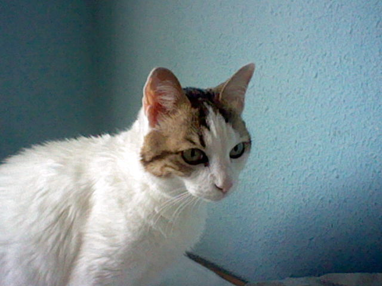
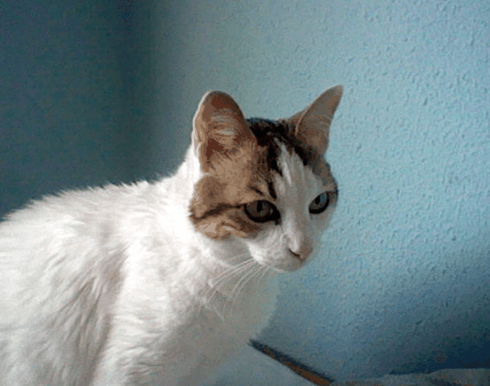

# mpo2gif

Convert Nintendo 3DS MPO stereoscopic images to wiggle GIFs and MP4s.

## What it does

Nintendo 3DS captures photos in **MPO format** — a multi-picture JPEG containing two frames (left eye and right eye). This script converts them into **wiggle GIFs** (and optionally MP4s) that alternate between both frames, creating a 3D depth effect without needing a 3D display.

It also **auto-detects the optimal stereo offset** per image using ORB feature matching, so the main subject stays stable while background/foreground objects show the 3D wiggle effect.

## Example

| Original (MPO) | Generated wiggle GIF |
|:---:|:---:|
|  |  |

## Installation

```bash
pip install -r requirements.txt
```

You also need **ffmpeg** installed and available in your PATH (only required for MP4 generation).

## Usage

### GUI (recommended)

The interactive GUI lets you visually select a **focal point** to control exactly where the wiggle effect is anchored. Click on the left image and the matching point is found automatically using template matching.

```bash
python mpo2gif_gui.py                          # Opens with file picker
python mpo2gif_gui.py /path/to/photo.MPO       # Open a specific file
python mpo2gif_gui.py /path/to/3ds/photos      # Open directory with prev/next navigation
```

Features:
- **Focal point selection** — click on the left image, auto-matches on the right
- **Rotation controls** — rotate 90° CW, 90° CCW, 180° for portrait photos
- **Live preview** — animated wiggle preview with adjustable speed slider (50–500ms)
- **Crop borders** — checkbox to remove glitchy edge padding caused by alignment
- **Batch navigation** — prev/next buttons to process multiple MPO files
- **Save GIF/MP4** — export with focal-point-aligned frames

### CLI

#### Single file

```bash
python mpo2gif.py -i /path/to/photo.MPO
```

#### All files in a directory (auto-crop, GIF only)

```bash
python mpo2gif.py -i /path/to/3ds/photos
```

#### GIF + MP4

```bash
python mpo2gif.py -i /path/to/3ds/photos --mp4
```

#### Custom output directory

```bash
python mpo2gif.py -i /path/to/3ds/photos -o /path/to/output
```

#### Manual crop offset

```bash
python mpo2gif.py -i photo.MPO -c 80
```

#### All options

```
usage: mpo2gif.py [-h] [-i INPUT] [-o OUTPUT_DIR] [-c CROP] [-d DURATION]
                  [--mp4] [--mp4-length MP4_LENGTH]

options:
  -i, --input            Path to a single .MPO file or a directory (default: .)
  -o, --output-dir       Output directory (default: <input-dir>/gifs)
  -c, --crop             Manual crop in pixels (default: auto-detect)
  -d, --duration         Frame duration in ms (default: 150)
  --mp4                  Also generate MP4 videos
  --mp4-length           MP4 length in seconds (default: 5)
```

## How auto-crop works

The script uses **ORB feature detection** (via OpenCV) to:

1. Detect keypoints in both the left-eye and right-eye frames
2. Match corresponding features between frames
3. Measure the horizontal disparity (pixel shift) for each match
4. Take the **median absolute disparity** as the optimal crop value

This makes objects at median depth appear stable, while closer/farther objects show the wiggle 3D effect — which is how human stereo vision naturally works.

## License

GPL-3.0 — see [LICENSE](LICENSE).
